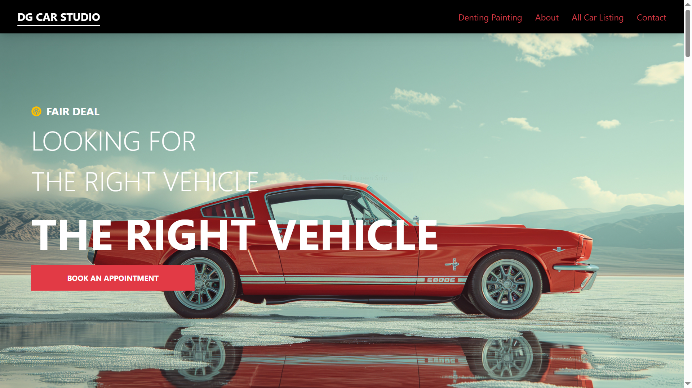

# Aman Shrivastava Portfolio 🚀

Welcome to my personal developer portfolio! This project showcases my skills, projects, and experience as a frontend developer.

## 🔥 About Me

I am a frontend developer with over 2 years of experience, primarily working with technologies like React.js, React Native, JavaScript, TypeScript, GIS, Leaflet, and Mapbox. I am passionate about building interactive, user-friendly web and mobile applications that solve real-world problems.

## 💼 Projects

### 🛰 Spade - Satellite Imagery Discovery Platform

- A web platform that allows users to order satellite imagery — both archived and tasking.
- Integrated with providers like ICEYE, BlackSky, Umbra, and Satellogic.
- Features include real-time satellite pass opportunities, high-res data ordering, and geospatial filtering using KML, GeoJSON, and Shapefiles.

### ✅ Task Management App

- Create and manage tasks by priority: High, Medium, and Low.
- Mark tasks as Pending or Completed.
- Edit tasks and view dashboard insights sorted by status and priority.

### 📱 Pixel Wallpaper App

- A mobile app that allows users to search and download high-quality wallpapers using the Pixabay API.
- Users can apply filters to find images by categories or tags.
- Downloaded images are saved directly into the device's gallery for easy access and usage.

### 🚗 DG Car Studio

- A car service platform focused on car sales, denting, and painting services.
- Users can choose car models and add damaged or required service panels for quotes.
- Includes a contact system to connect with the service team for further assistance and bookings.

## 📸 Screenshots

## 📦 Tech Stack

- React.js
- React Native
- TypeScript
- JavaScript
- Leaflet, Mapbox
- Chakra UI
- Redux Toolkit
- Pixabay API

## 📬 Contact

Feel free to reach out on [LinkedIn](https://www.linkedin.com/in/aman-shrivastava-99b046231/) or fork this repo and build your own!
